## 📌 Tujuan & Latar Belakang Proyek

Aplikasi **TOKORIZA** dibuat sebagai **tugas Project E-Business 2** dengan tujuan utama untuk menerapkan konsep **e-commerce modern** dalam sebuah sistem berbasis web. Proyek ini dirancang untuk mensimulasikan proses jual beli online secara nyata, mulai dari proses **autentikasi pengguna**, **manajemen produk**, **transaksi pemesanan**, hingga **pengelolaan pesanan dan pendapatan oleh seller**.

Melalui pengembangan aplikasi ini, diharapkan mahasiswa mampu memahami dan mengimplementasikan konsep penting dalam e-business, seperti **manajemen user dan role**, **alur transaksi digital**, **pengelolaan data produk**, serta **integrasi antarmuka pengguna (UI) dengan sistem backend**. Aplikasi TOKORIZA dibangun menggunakan framework **Laravel** dengan pendekatan MVC agar sistem terstruktur, aman, dan mudah dikembangkan di masa depan.

---

## 🔐 Authentication & Account

### Laman Login
Laman login digunakan sebagai gerbang utama pengguna untuk mengakses sistem TOKORIZA. Pengguna dapat melakukan login menggunakan **email atau nomor HP** yang telah terdaftar serta **password**. Sistem akan memvalidasi data login sebelum memberikan akses ke halaman utama sesuai dengan role pengguna.

---

### Laman Register
Laman register berfungsi sebagai tempat pendaftaran akun baru bagi pengguna. Pada halaman ini, pengguna diwajibkan mengisi data berupa **nama lengkap, email, nomor HP, password, dan konfirmasi password**. Data yang dimasukkan akan divalidasi sebelum disimpan ke dalam sistem.

---

### Laman Account
Laman account menampilkan informasi akun pengguna yang sedang login. Pada halaman ini tersedia menu **detail akun**, **alamat pengiriman**, **FAQ**, dan **contact**. Pengguna juga dapat melakukan **edit profile**, **update password**, serta **menghapus akun** secara mandiri.

---

### No Access 403
Halaman No Access 403 akan ditampilkan ketika pengguna mencoba mengakses halaman yang tidak sesuai dengan hak akses atau role-nya, seperti halaman khusus **admin atau seller**. Halaman ini berfungsi untuk menjaga keamanan dan pembatasan akses sistem.

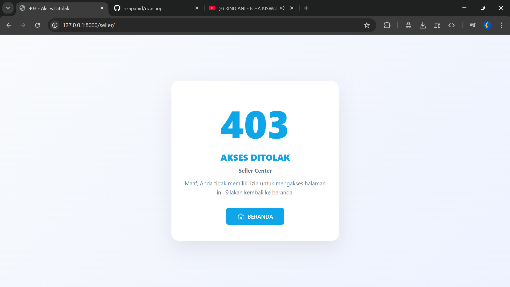

---

## 👤 User View (Customer)

### Laman Home
Laman home merupakan halaman utama yang ditampilkan kepada pengguna setelah login. Halaman ini menampilkan **banner promo**, **menu cepat**, serta **produk yang ditampilkan berdasarkan kategori**, sehingga pengguna dapat dengan mudah menemukan produk yang diinginkan.

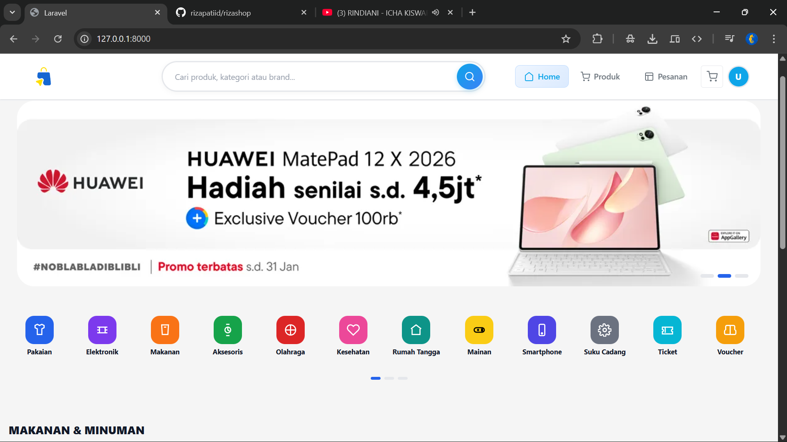

---

### Laman Produk
Laman produk menampilkan seluruh produk yang tersedia di TOKORIZA. Pengguna dapat menggunakan **filter kategori produk** untuk mempersempit pencarian sesuai kebutuhan.

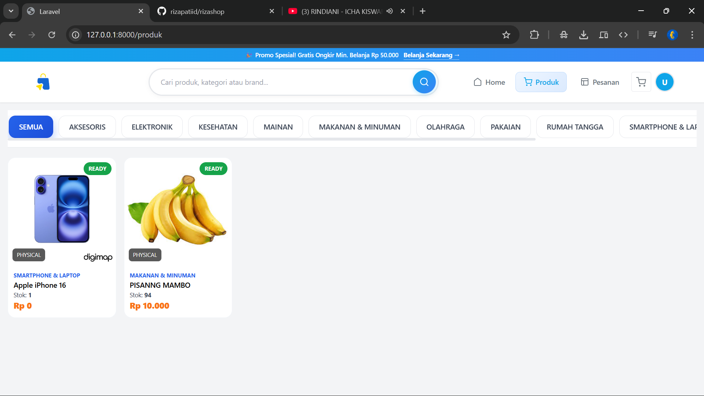

---

### Laman View Produk
Laman view produk menampilkan detail lengkap dari sebuah produk, meliputi **gambar produk, nama produk, kategori, jenis produk, deskripsi, serta pilihan varian**. Dari halaman ini, pengguna dapat langsung **menambahkan produk ke keranjang** atau melanjutkan ke **checkout**.

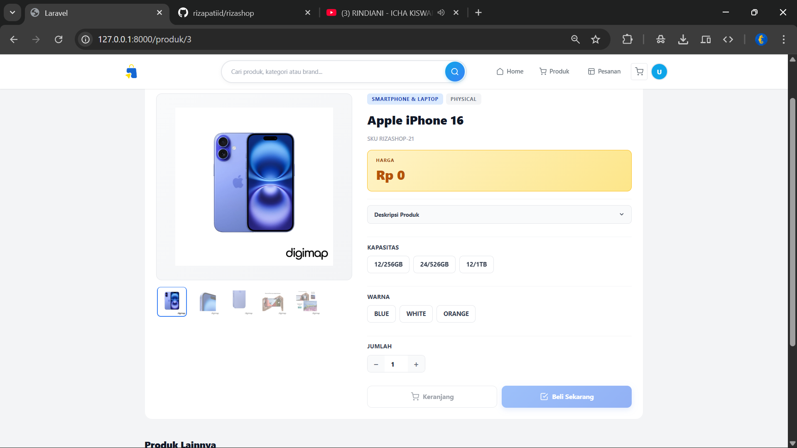

---

### Laman Keranjang
Laman keranjang menampilkan daftar produk yang telah ditambahkan oleh pengguna. Halaman ini juga menampilkan **total harga keseluruhan** serta tombol **checkout** untuk melanjutkan transaksi.

---

### Laman Checkout
Laman checkout digunakan untuk menampilkan **alamat pengiriman**, **metode pengiriman**, **catatan pesanan**, serta **ringkasan pesanan** sebelum pembayaran diproses.

---

### Laman Pesanan
Laman pesanan menampilkan seluruh **riwayat pesanan pengguna**. Tersedia **filter status pesanan** untuk memudahkan pengguna melihat pesanan berdasarkan status tertentu.

---

### Laman View Pesanan
Laman view pesanan menampilkan detail lengkap dari pesanan yang dipilih, seperti **data penerima**, **produk yang dipesan**, **riwayat status pesanan**, **jasa pengiriman**, dan **total pembayaran**.

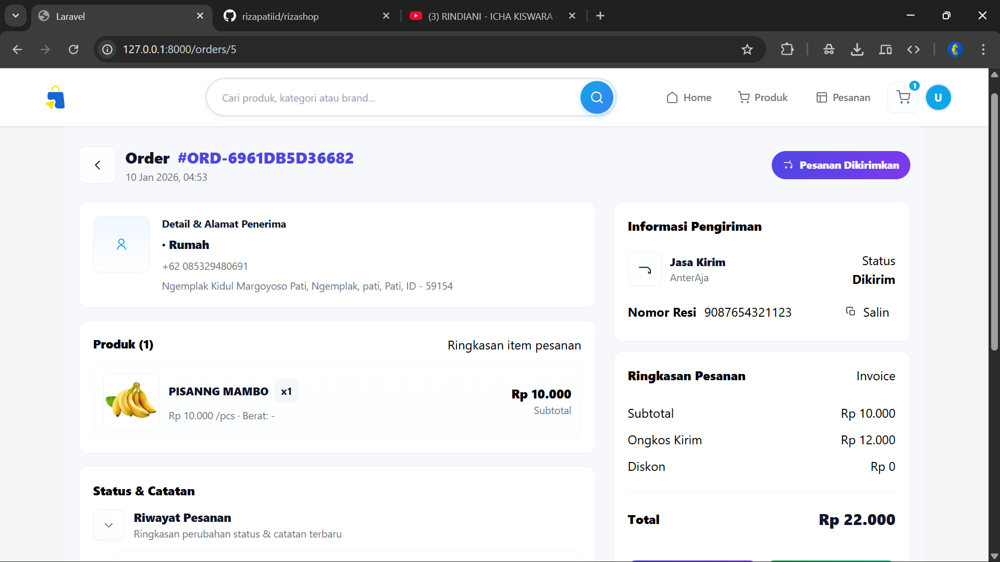

---

## 🧑‍💼 Dashboard Seller

### Laman Beranda
Laman beranda pada dashboard seller menampilkan **statistik pendapatan**, ringkasan produk, serta informasi penting lainnya untuk membantu seller memantau performa toko.

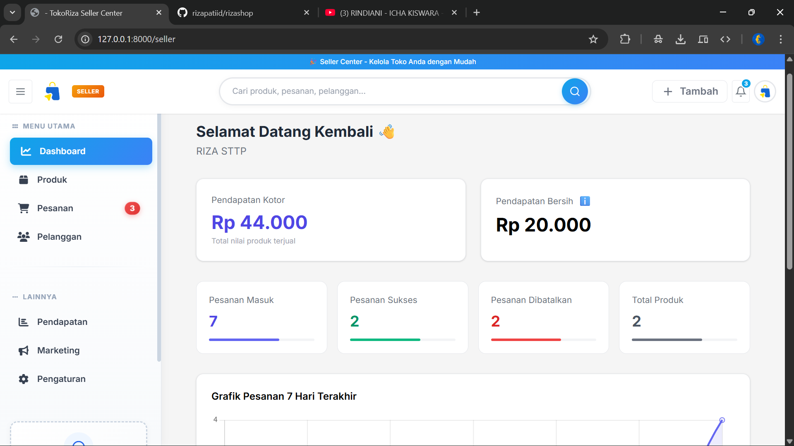

---

### Laman Produk
Laman produk pada dashboard seller menampilkan daftar produk yang dimiliki seller, lengkap dengan **gambar produk, jumlah terjual, stok tersedia**, serta tombol **edit dan hapus**.

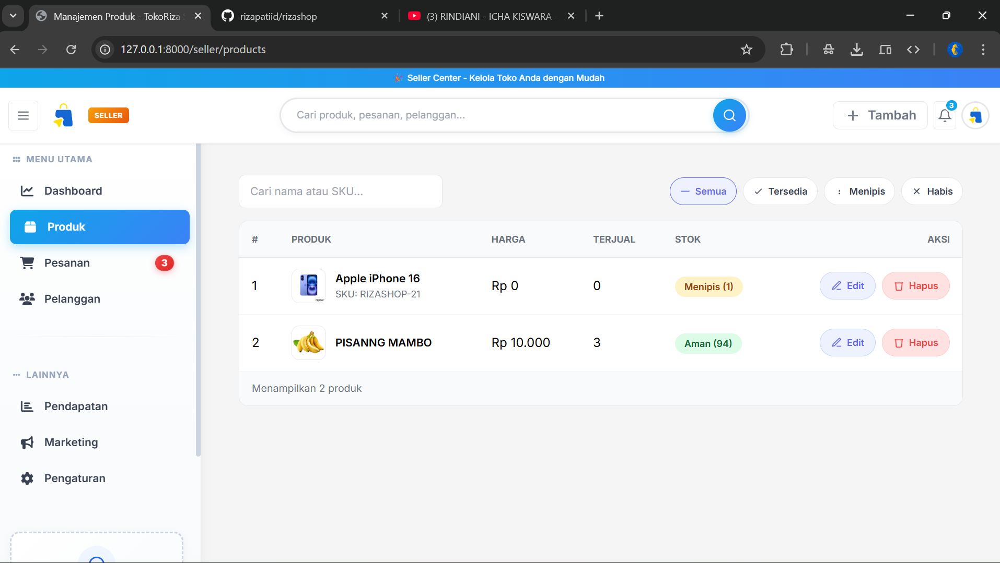

---

### Laman Pesanan
Laman pesanan menampilkan daftar pesanan yang masuk ke seller, dilengkapi dengan **filter status**, **informasi pelanggan**, dan tombol **kelola pesanan**.

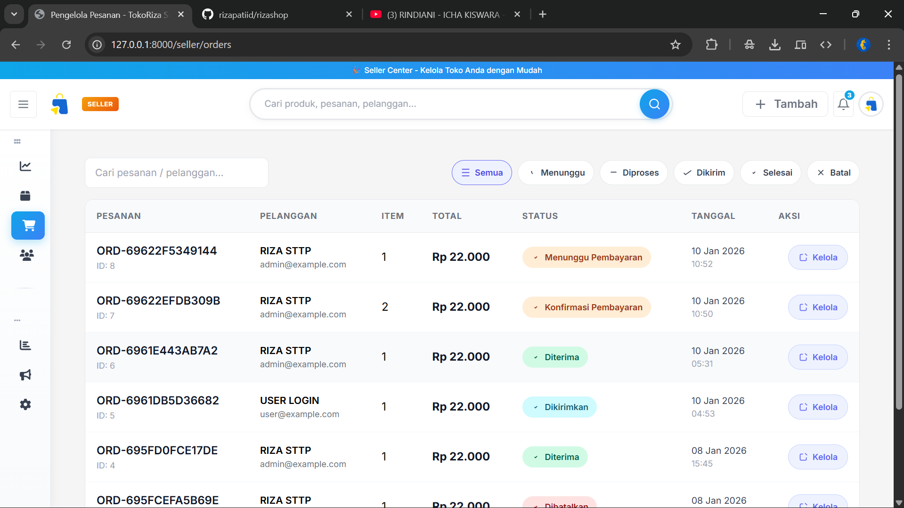

---

### Laman Marketing
Laman marketing digunakan untuk mengelola **banner promosi** yang akan ditampilkan pada halaman user.

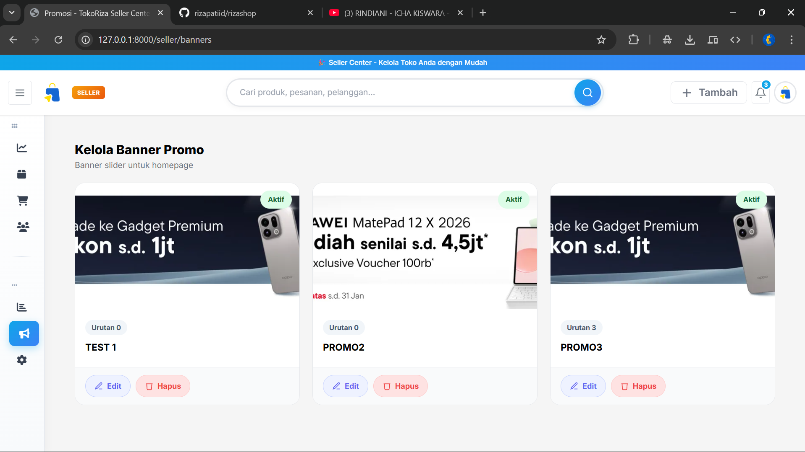

---

### Laman Pendapatan
Laman pendapatan menampilkan ringkasan **total pendapatan seller** serta daftar pesanan yang berkontribusi terhadap pendapatan tersebut.

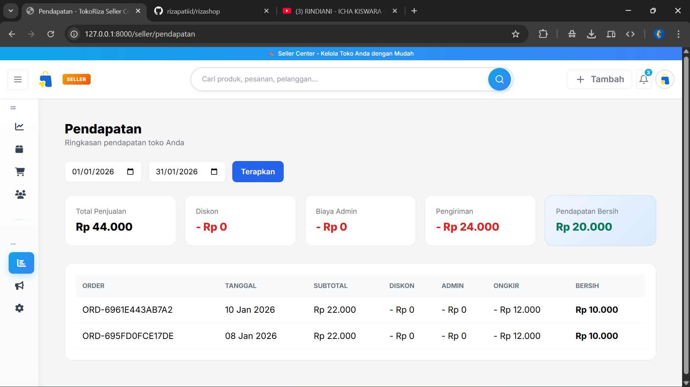

### Pengguna
Laman Pengguna menampilkan ringkasan **user yang terdaftar** 

Tambah Produk
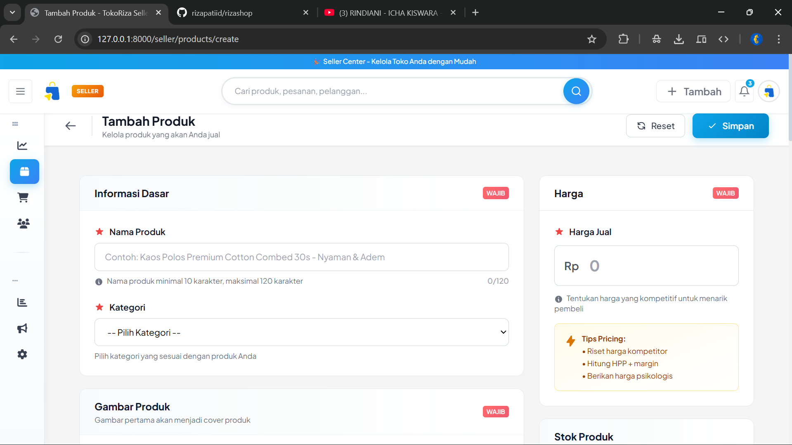
Buat Promo
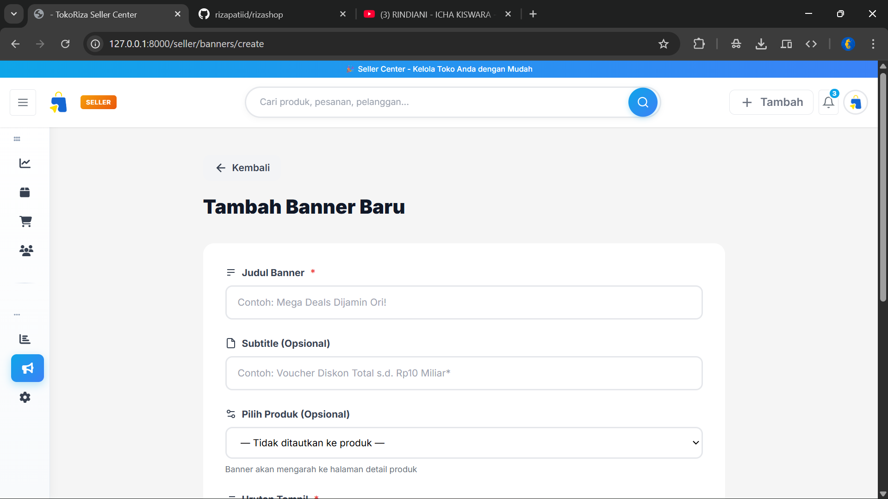
---

## 🧰 Teknologi yang Digunakan
- Laravel  
- Blade Template  
- MySQL  
- Bootstrap / Custom UI  
- Laravel Authentication  

---

  

  
  
  
  

Aplikasi TOKORIZA diharapkan dapat menjadi contoh implementasi **sistem e-commerce berbasis web** yang terstruktur dan fungsional. Proyek ini tidak hanya memenuhi kebutuhan akademik pada mata kuliah **E-Business 2**, tetapi juga menjadi sarana pembelajaran dalam membangun aplikasi web yang siap dikembangkan lebih lanjut.
---
Copyright © 2026 RIZAPATIID. All rights reserved.
---