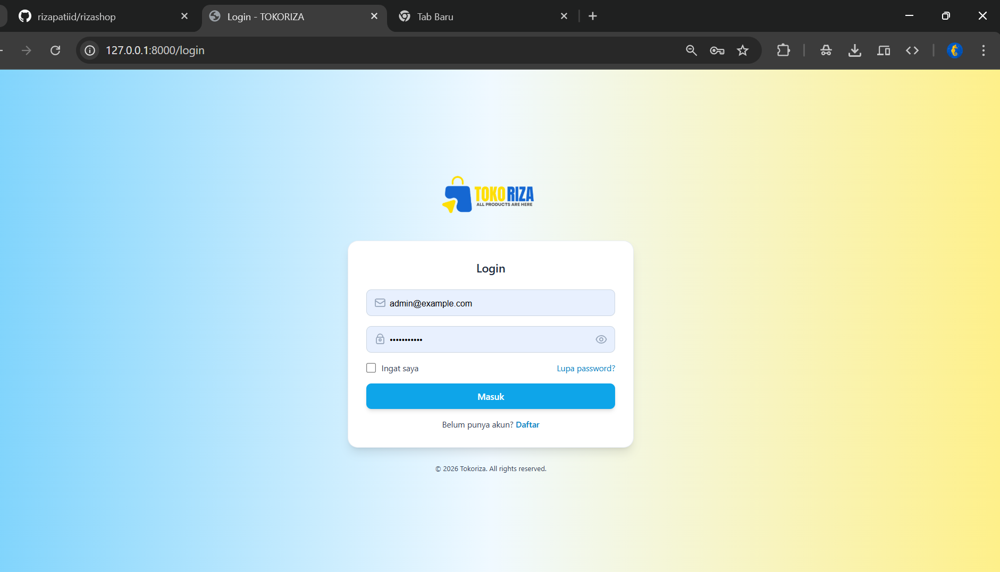
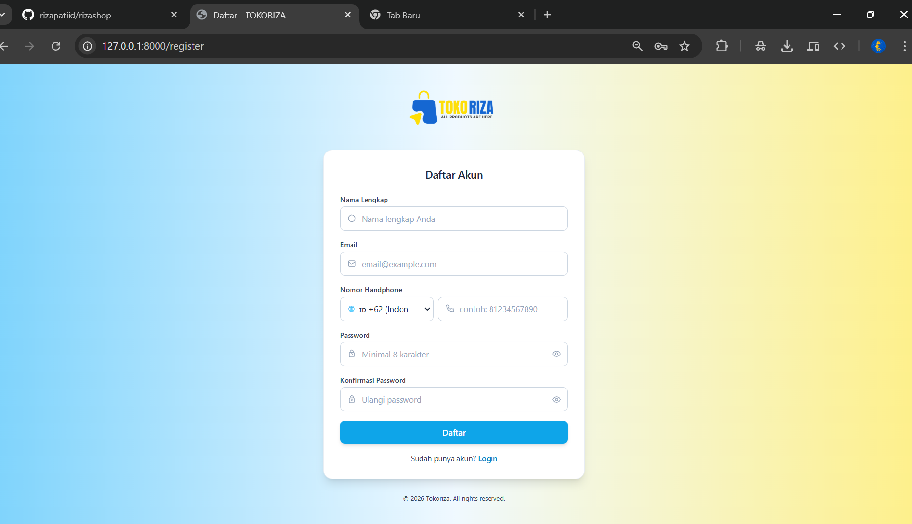
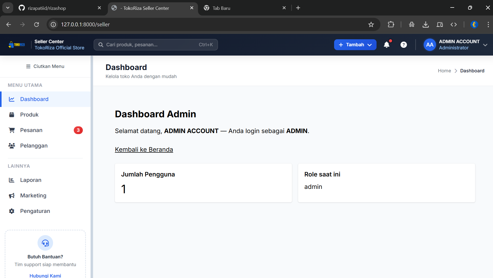
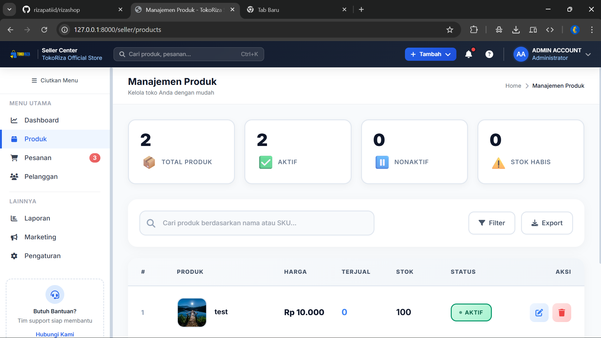
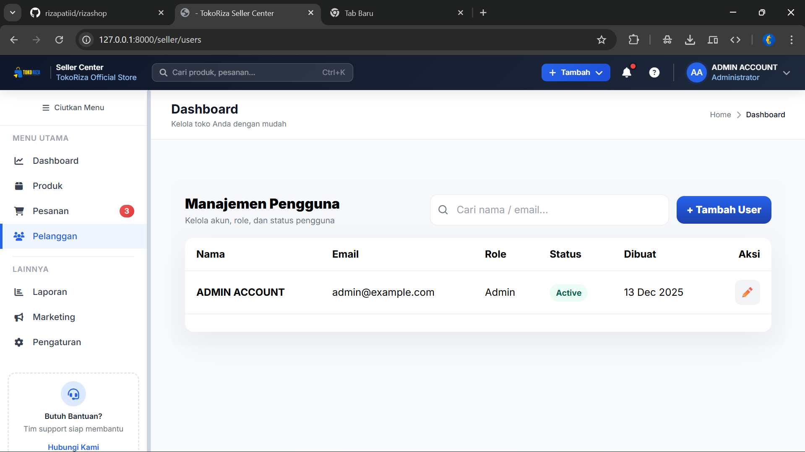
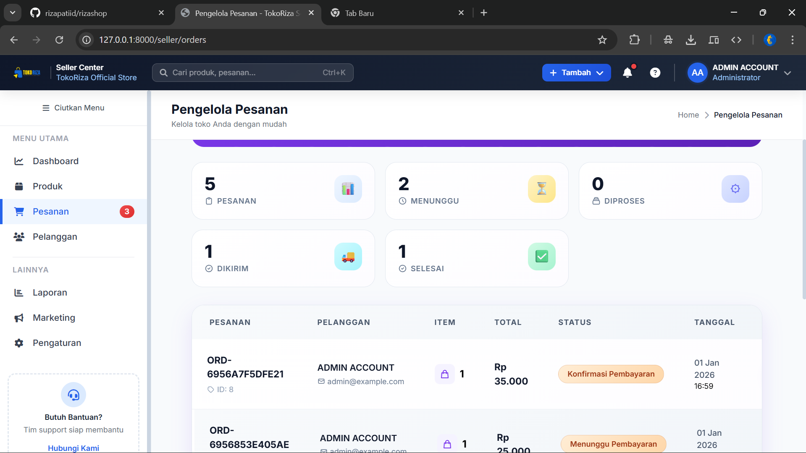
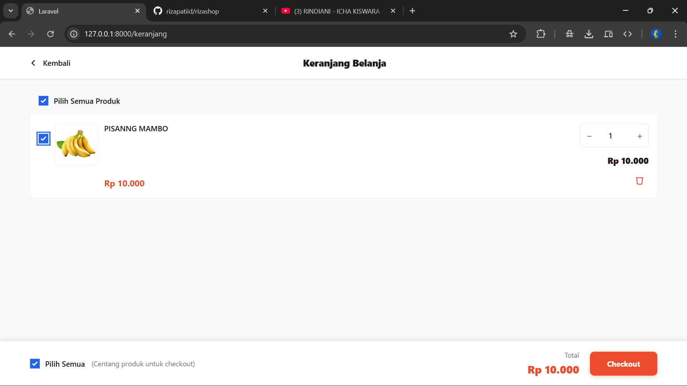
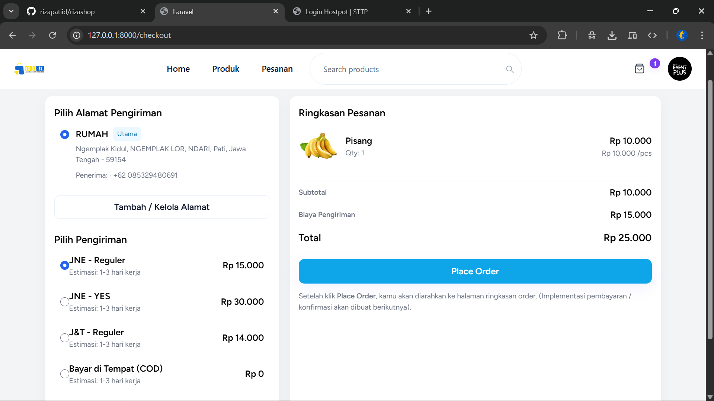

# 🛒 Laravel Marketplace Project

Aplikasi **Marketplace berbasis Laravel** dengan sistem **multi-role** yang dirancang untuk **Seller (Admin)** dan **Pelanggan (User)**.  
Saat ini pengembangan difokuskan pada **Seller & Pelanggan**, dengan rencana pengembangan lanjutan untuk role tambahan dan fitur pendukung.

---

## 🚀 Status Pengembangan
- ✅ Seller (Admin) – Aktif
- ✅ Pelanggan (User) – Aktif
- ⏳ Admin Utama – Perencanaan
- ⏳ Live Chat Customer Service – Pengembangan
- ⏳ Custom UI User – Pengembangan

---

## 🔐 Authentication
Fitur autentikasi dengan **UI custom**:
- Login
- Register
- Forget Password

---

## 📊 Dashboard
Dashboard dibedakan berdasarkan role pengguna:

### 👤 Pelanggan (User)
- Route: `/dashboard` *(rencana akan menjadi `/`)*

### 🛍️ Seller (Admin)
- Route: `/masterdashboard` *(rencana akan menjadi `/seller`)*

---

## 👤 Profile Page (Custom)
Route: `/account`  
Tampilan profile **akan dibedakan** antara Seller & Pelanggan.

### Fitur Profile:
- Edit foto profil
- Edit data profil
- Ubah password
- Hapus akun

### 📍 Manajemen Alamat *(Sudah Fix)*:
- Tambah alamat
- Edit alamat
- Hapus alamat
- Set alamat utama

### ❓ Bantuan:
- Hubungi CS *(Live Chat – dalam pengembangan)*

---

## 🛠️ Dashboard Seller (Admin)

### 📦 Manajemen Produk  
Route: `/products`  
> Sistem sudah berjalan, UI masih dalam pengembangan

- Tambah produk
- Edit produk
- Hapus produk

### 👥 Manajemen Pengguna  
Route: `/users`  
> Sistem sudah berjalan, UI masih dalam pengembangan

- Tambah pengguna
- Edit pengguna
- Hapus pengguna

---

## 🛒 Dashboard Pelanggan (User)
> Fitur sudah berjalan, UI masih default

- Melihat produk (`/produk`)
- Tambah ke keranjang
- Keranjang (`/keranjang`)
- Checkout (`/checkout`)

---

## 📸 Screenshot UI

### 🔐 Authentication

  
  

---

### 👤 Dashboard Pelanggan

  

---

### 🛍️ Dashboard Seller (Admin)

  

---

### 📦 Manajemen Produk

  

### 📦 kelola Pengguna

  

### 📦 Pesanan

  

---

### 🛒 Keranjang & Checkout

  
  

---

## 🧰 Teknologi yang Digunakan
- Laravel
- Blade Template
- MySQL
- Bootstrap / Custom UI
- Laravel Authentication

---

  

  
  
  
  

---

## 📌 Catatan
Project ini masih dalam tahap **pengembangan aktif** dan akan terus dikembangkan dari sisi fitur maupun tampilan UI.

---

## 📄 License
Project ini menggunakan lisensi **MIT**.
